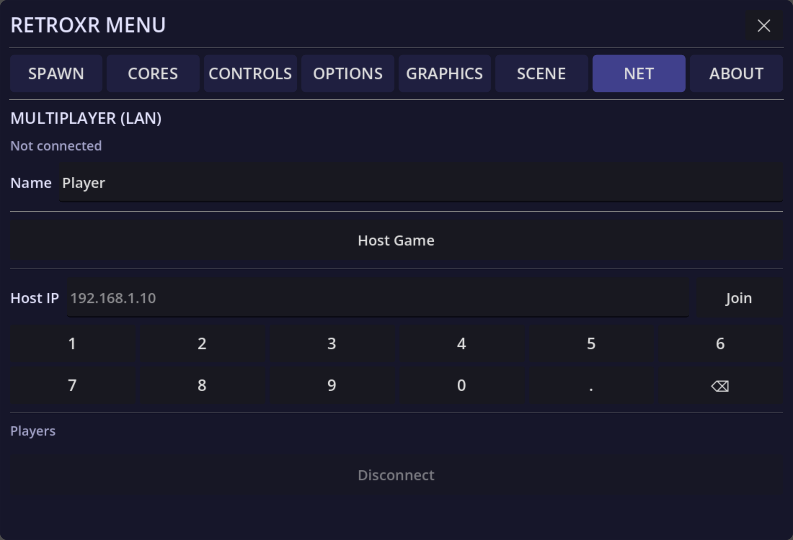

:::danger[This is a prototype]
Netplay is in the build, and it is **very early and very lightly tested**. Treat it as
something to experiment with rather than something to rely on. If it does not work, that
is the expected outcome rather than a misconfiguration on your part.
:::

## What it is

One player hosts, others join by IP. The emulator runs with **rollback netcode**, the same
approach fighting games use, so inputs are predicted and corrected rather than waited for.

Beyond the game itself, the room is shared: player poses are broadcast, so you can see
each other as avatars, and objects stay in sync. The core and the ROM can be transferred
to whoever does not have them.

v0.4.0 reworked the netcode strategy under the hood and fixed a long list of object-sync
bugs, so the shared room holds together better than it did — but the warning above still
stands unchanged.

## Using it

Open the **`NET`** tab. One person hosts; the others enter that machine's address to join.

Both machines need to be able to reach each other on the network. Across the internet that
means port forwarding, with all the usual difficulty that implies.

## Known limits

- Very lightly tested — expect desyncs.
- Both ends need the same core and the same ROM.
- There is no matchmaking, no lobby list and no NAT traversal. It is an IP address.

