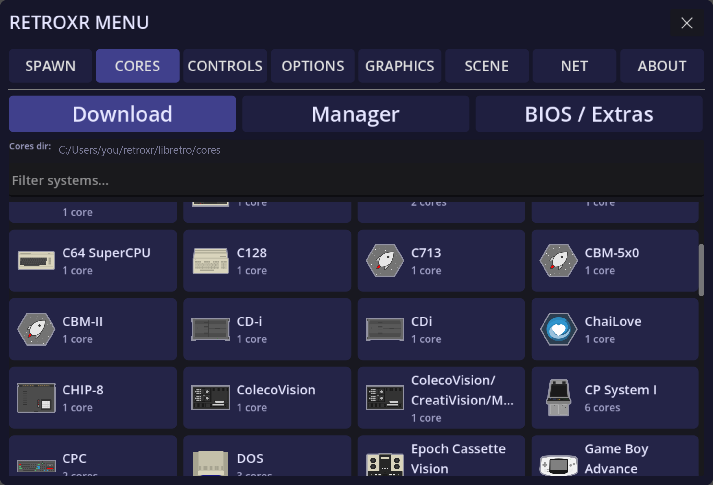

Everything here lives under the **`CORES`** section of the menu, which has three views.

## Download

A scrollable grid of every system RetroXR knows about, each showing how many cores are
available for it.



Pick a system, pick a core, and it downloads in the headset. No PC, no unzipping, no
copying files.

Where a system has an obvious best choice it is marked **recommended**.

## Manager

Once you have more than one core for a system, this is where you say which one it launches
with. Systems are shown as a grid, each labeled with its current default.


This is also where **core options** live. Every core exposes its own settings — region,
video filters, accuracy trade-offs, controller emulation — and you can change them here,
or reset them back to the core's defaults if you have made a mess.

## BIOS / Extras

Which systems need firmware, which files exactly, and whether each is required or
optional. It has [its own page](/guide/cores/bios/).

## Where all of this actually lives

Everything the `CORES` section touches is written into one folder, `libretro/`:

| Platform | Path |
| --- | --- |
| Windows | `%USERPROFILE%\retroxr\libretro` |
| Linux / macOS | `~/retroxr/libretro` |
| Quest | `/data/user/0/com.xenu.retroxr/files/libretro` — the app's **internal** storage, browsable as `libretro/` in the [web file manager](/guide/adding-games/) |

On Quest this is worth reading twice: `libretro/` is **not** next to your games on
`/sdcard`. It is inside the app's private storage, which is why `adb push` and SideQuest's
file browser cannot see it. The web file manager is the way in.

### What each folder is for

| Folder | What it holds | Do you touch it? |
| --- | --- | --- |
| `cores/` | The emulator cores themselves, one file each. | **No.** Download them here. A core dropped in by hand is never registered in the manifest, so nothing will use it. |
| `system/` | BIOS and firmware, **in a subfolder per core**. | Sometimes — this is the one folder you may legitimately need to open. See [BIOS files](/guide/cores/bios/). |
| `core_assets/` | Asset packs some cores need, also per core. | No — the downloader fills these. |
| `core_options/` | Your settings for each core, written when you change something in Manager. | Prefer resetting from the Manager over editing the file. |
| `save/` | Battery saves and memory cards. See [game saves](/guide/connecting/saves/). | Back it up; don't hand-edit it. |
| `temp/` | Scratch. A core is copied here before it runs, so two machines can run the same core without treading on each other. | Nothing here is worth keeping. |

And three files at the top level:

| File | What it is |
| --- | --- |
| `cores_manifest.json` | What is available to download, and what you already have. |
| `core_defaults.json` | Which core each system launches with — what the Manager writes. |
| `firmware_state.json` | A hash cache for BIOS checking. Presence is always re-read from disk, so deleting this changes nothing except that files get re-hashed. |

### The per-core rule

`system/`, `core_assets/` and part of `save/` are all keyed **by core name**, not by system:

```
libretro/system/mednafen_psx_hw/scph5500.bin
libretro/core_assets/ppsspp/...
libretro/save/pcsx_rearmed/<game>/<save>.srm
```

So installing a second core for a machine gives you a second, empty firmware folder. That
is the usual reason a game that ran fine yesterday boots to a black screen after you
switched cores.

Memory cards are the deliberate exception — see
[the PlayStation](/guide/platforms/playstation/).

## Updating and removing

Cores can be re-downloaded to pick up a newer build, and removed when you no longer want
them. A system with no core installed simply cannot be spawned — that is the constraint
you are managing.

:::note
Changing the default core for a system does not migrate saves between cores. Different
cores can use different save formats, so a game saved under one may not be seen by
another.
:::
