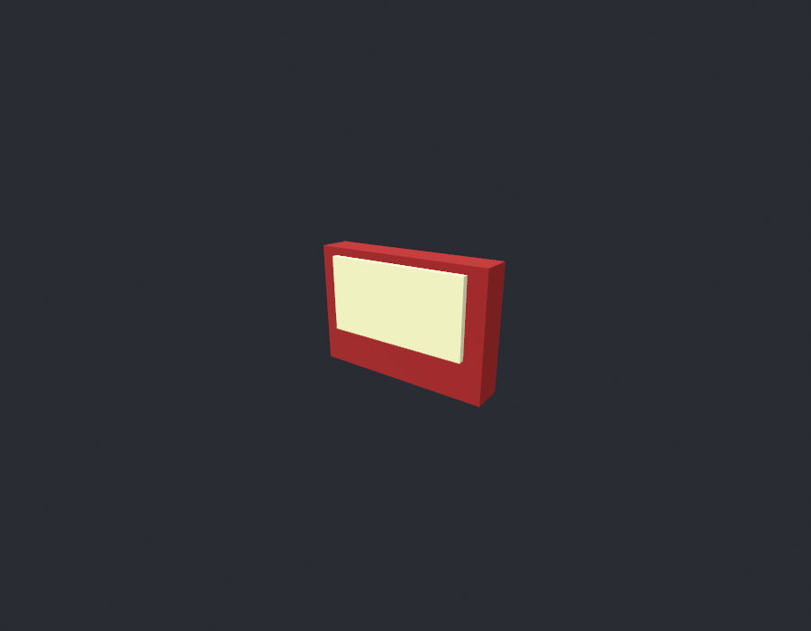
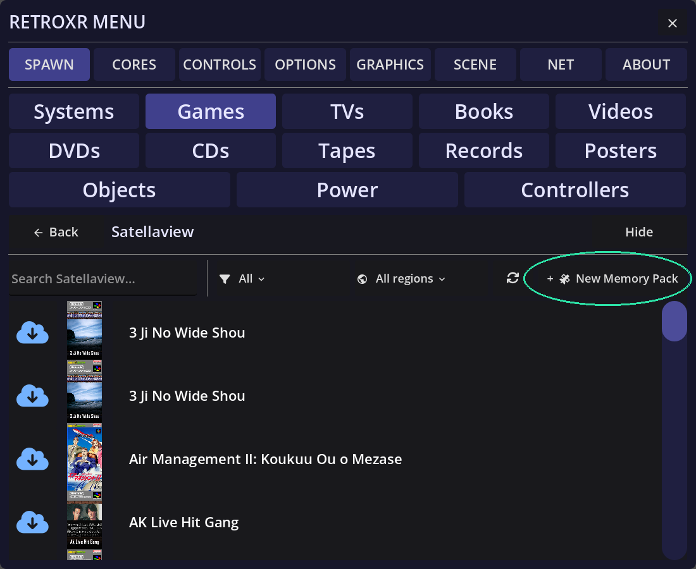
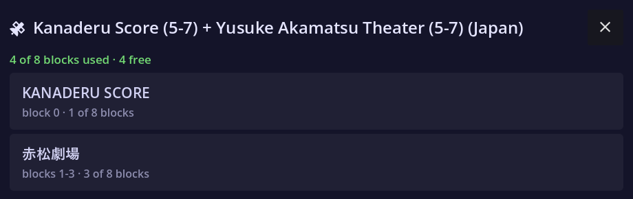

import { Aside, Steps } from '@astrojs/starlight/components';
import Turntable from '../../../../components/Turntable.astro';
import stackPoster from '../../../../assets/satellaview/stack_poster.png';
import memoryPackPoster from '../../../../assets/satellaview/memory_pack_poster.png';
import packContents from '../../../../assets/satellaview/pack_contents.png';

In 1995 Nintendo bolted a **satellite modem** to the underside of the Super Famicom.
St.GIGA broadcast games, magazines and radio into it on a schedule, you downloaded them
onto an **8M Memory Pack**, and what you had not caught by the end of the slot you had
missed. The service went dark in 2000, and everything that survives survives because
somebody wrote it to a pack and kept it.

RetroXR models all three layers of that, as of **v0.5.0**.

## The three pieces

The Satellaview is the object people picture, but it is not the thing you put a game into.
Three separate objects stack up:

| Piece | What it is | Where it goes |
| --- | --- | --- |
| **Satellaview** | The base station — tuner and modem, two lamps, no slot at all | The Super Famicom stands **on** it |
| **BS-X** | A Super Famicom cartridge carrying the shell program | **Into** the console's cartridge slot |
| **8M Memory Pack** | The flash medium a broadcast is written to | **Into** the BS-X cartridge |

<Turntable
	src="/video/satellaview/stack.mp4"
	poster={stackPoster}
	alt="The assembled Satellaview stack rotating: the base station on the bottom, the Super Famicom standing on it, the BS-X cartridge upright in the console's slot, and an 8M Memory Pack seated in the well in the cartridge's roof."
	caption="All four layers at once — base station, console, BS-X cartridge, memory pack. The Super Famicom wears the procedural stand-in; it has no modelled shell yet."
/>

That layering is the real hardware's, not a simplification. The base station genuinely has
no mouth on it — it is a receiver — so the media goes in above it. See
[expansion hardware](/guide/playing/expansion-hardware/) for how a stack is assembled.

<Aside type="note" title="The BS-X runs without the base station">
	A BS-X cartridge in a bare Super Famicom boots and puts you in the town, exactly as the
	hardware did. There is simply nothing being broadcast at you. Bolt the base station on
	when you want the other half.
</Aside>

## What you need

- **snes9x**, which RetroXR selects for you when the stack is built.
- Your `.bs` files in the `satellaview` folder of your ROM library.
- **The BS-X shell program**, by either of the two routes below.

### Two ways to get a BS-X

**As firmware.** Put `BS-X.bin` in `libretro/system/snes9x/` and the BS-X appears in the
spawn menu as a unit you can spawn like any other. Until it is installed, it is not offered
at all. See [BIOS and firmware](/guide/cores/bios/).

**As a ROM in your library.** Drop a BS-X `.sfc` into the same `satellaview` folder your
`.bs` files live in — **including an English-translated dump**, which is how most people
will want to read the town — and spawn it straight from the library. You get the real BS-X
cartridge, with the well in its roof that a memory pack goes into, not a plain slab.

<Aside type="tip" title="The library wins">
	If you have both, the dump you can see in your library is the one that gets spawned. It
	is the copy you chose, and the one whose region and translation you can check by
	looking.
</Aside>

Inside the `satellaview` folder the **extension is what separates the two kinds of file**:
a `.sfc` is the shell, a `.bs` is a memory pack.

## The lamps mean something

The base station wears **POWER** and **ACCESS**, and both report the machine rather than
being decoration. POWER follows the console bolted above it. ACCESS is the tuner's own —
the emulated BS-X flips it while data is moving, snes9x reports that over libretro's LED
interface, and the lamp lights **because the emulated machine said so**.

New in v0.5.0: the LED interface that carries it went into RetroXR's snes9x fork for
exactly this.

## 8M Memory Packs

A pack is a **medium, not a game**, and RetroXR treats it as one.



### Minting a blank one

A blank pack is something you had to *buy* — a broadcast needs somewhere to land, and every
other platform's media arrives as a dump of something that already exists. So the
Satellaview shelf is the one place in RetroXR that can **mint a new medium**.

Open `SPAWN` → **`Games`**, find **Satellaview**, and the button at the top right of its
shelf is **+ New Memory Pack**. Press it and a blank, correctly formatted 8 Mbit pack
appears in your library, ready to receive.



New packs are named for you and simply count up — `MEMORY PACK.bs`, `MEMORY PACK 2.bs`,
`MEMORY PACK 3.bs` — so mint as many as you want to keep transmissions on separate media.
They land in `roms/satellaview/` beside everything else, which is where they have to be.

### Reading what is on one

Point at a pack in the room and **click the left thumbstick** (or press `TAB` on desktop)
and you get **what is written on it** — each programme and the blocks it occupies — rather
than the Saves and Achievements list a game cartridge offers.



A pack is allotted in **eight blocks of one megabit**, and the panel shows which programme
holds which. The image is re-read every time you open it, because a pack seated in a
running BS-X is being written to while you watch.

The list is deliberately **read-only** — there is no delete. The block-erase behaviour has
not been pinned down, and a wrong guess destroys a download that can only be obtained from
a live broadcast.

<Aside type="caution" title="snes9x fixes for this landed in v0.5.0">
	Saving a download to an 8M pack needed two fixes in RetroXR's snes9x fork: flash pack
	writing for BS-X, and a bug where the 8 Mbit flash was initialised to the wrong values.
	An older build will not keep what you catch.
</Aside>

## Some programmes need an IPS patch

A few broadcasts cannot start from a dump alone. **BS F-Zero Grand Prix** is the clearest
case: it was a SoundLink title whose music and timing arrived over the satellite during a
live event, and with nothing being broadcast it never leaves its opening screen — the CPU
ends up executing its own ROM header as code. Grand Prix 2, which was not a live event,
runs untouched.

The Satellaview community's fix is an **IPS patch** that re-enables the in-game music and
lets START move past that screen. Those patches are not RetroXR's to ship, so it looks for
one you have put **beside the programme**:

```
roms/satellaview/BS F-Zero ... .bs     <- your dump, never written to
roms/satellaview/BS F-Zero ... .ips    <- the patch, dropped in by hand
```

Match the base name and RetroXR does the rest. Your original is **never modified**: the
patch is applied to a copy held outside the ROM folder, keyed by a hash of both files, so
replacing the patch rebuilds it on the next launch. A programme with no `.ips` beside it is
handed to the core untouched, with no copy made at all.

<Aside type="note" title="Why the copy is not kept in the ROM folder">
	A second `.bs` there would show up as a second entry on your shelf — and, worse, snes9x
	resolves its broadcast directory from the loaded file's own folder, so it matters which
	copy is the one being run.
</Aside>

## Satellaview+ — the broadcast came back

[**Satellaview+**](https://satellaview-plus.com) is a community project that puts a
scheduled Satellaview broadcast back on the air — a real timetable, running now, in the
same shape the original service had. Its client keeps a folder of the current
transmissions on your PC.

That folder is all RetroXR needs, because a broadcast really is a file appearing where the
emulated tuner looks for it.

<Steps>

1. Run the **Satellaview+ client** on the same PC, and let it fill its `roms/satellaview`
   folder.

2. **Point RetroXR's sat folder at it**, so the two are looking at the same place — the
   emulated tuner reads a broadcast straight out of that directory.

3. Build the stack — Satellaview, Super Famicom, BS-X cartridge — and put an **8M Memory
   Pack** in the cartridge. A translated BS-X `.sfc` sitting in that same folder works here
   exactly as the firmware copy does, and is the easier one to navigate.

4. Power on, walk into the town, and use the satellite terminal to download whatever is
   being transmitted in this hour's slot. The ACCESS lamp will tell you it is working.

</Steps>

<Aside type="caution" title="The broadcast files go in the root of the folder, flat">
	snes9x looks for `BSX<hhhh>-<d>.bin` **directly beside the ROM it loaded** — it joins the
	name onto that one directory and nothing else. So the transmission files have to sit in
	the root of `roms/satellaview/`, alongside your BS-X `.sfc` and your `.bs` packs.

	Leave them in the dated and hourly subfolders the service publishes them under and the
	BS-X finds nothing, boots the town and reports **no signal** — which looks exactly like a
	slot with nothing being broadcast in it.
</Aside>

Whatever you catch is written to the pack, and the pack is yours. Miss the slot and it is
gone, which is the point.

<Aside type="caution" title="PCVR only, for now">
	This needs the Satellaview+ client running alongside RetroXR, and there is **no in-app
	client on Quest yet** — a standalone headset has nowhere to run one. On Quest the
	Satellaview still works; you play the dumps you already have rather than a live
	broadcast.
</Aside>
