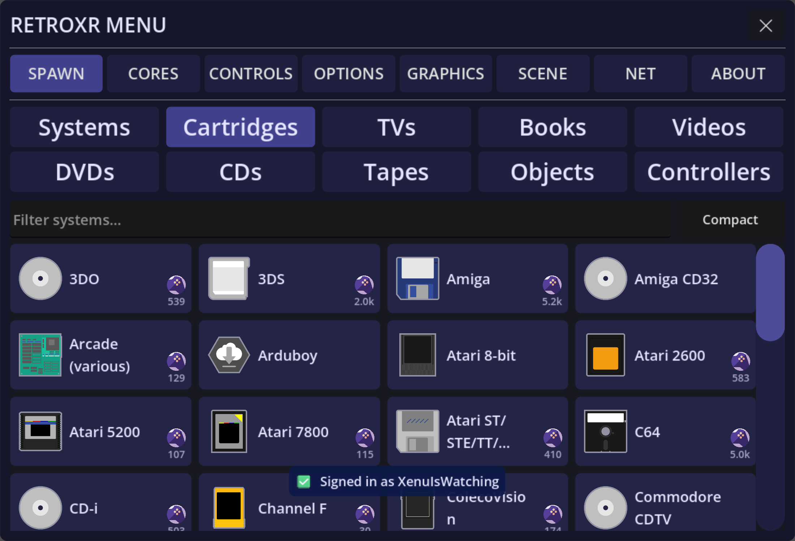

A game is not a menu entry you launch. It is an object carrying a file path, and it has to
go into the machine.

## Cartridges

Open **`SPAWN`** → **Games** and click a game. The cartridge spawns into the hand
that clicked, already carrying that ROM.

Push it into the console's slot. **It has to go in the right way up** — a cartridge held
upside down will not seat, exactly as it would not have then.

Pull it back out by grabbing it and lifting. Swapping cartridges while the machine is
powered on does what you would expect it to do.

## Discs

Disc-based systems take a disc into a tray or a slot. Open the lid or eject the tray,
place the disc in, close it, and power on.

### Swapping discs mid-game

Multi-disc games work the way they did. On cores that support disc control you can take
disc 1 out and put disc 2 in while the game is running, and it carries on — which is the
only way to finish a game that asks for the next disc.

Since v0.4.0, **pulling a disc out no longer switches the machine off** on those cores.
The console keeps running with an empty tray, waiting for the next disc, exactly as it
should.

## UMDs

PSP titles come as UMDs, which slot into the back of the handheld.

## Memory cards

Systems that used memory cards have them as separate objects you plug into the console's
card slots. Your saves live on the card, not in a hidden folder.

The PlayStation's card can be browsed from inside the room — you can see the blocks used,
and manage what is on it. A running PlayStation also notices when card slot 1 is emptied,
so pulling a card mid-game is something the game sees.

The GameCube takes **raw memory card files** as of v0.4.0, so a card image from elsewhere
is one you can use here.

:::note
Saves are per card, so if a game is not finding your save, check that the same card is in
the same slot.
:::

## Where the files come from

Everything in these tabs is read from your own folders — `roms/`, `dvd/`, `videos/`,
`books/` and `music/`. Nothing ships with the app. See
[adding your games](/guide/adding-games/).
