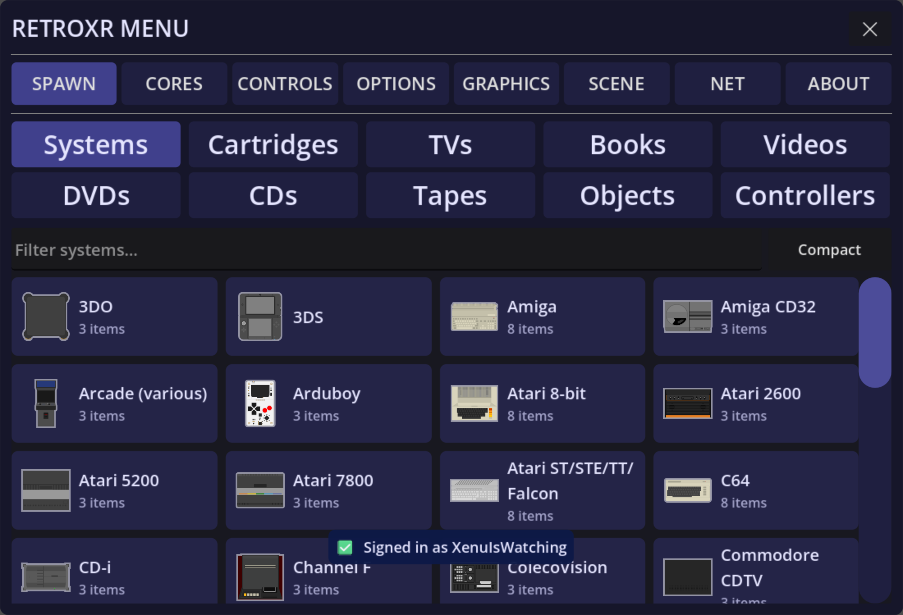
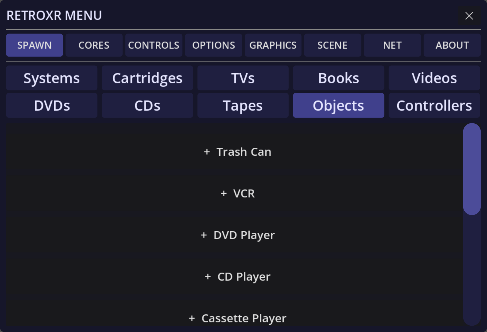
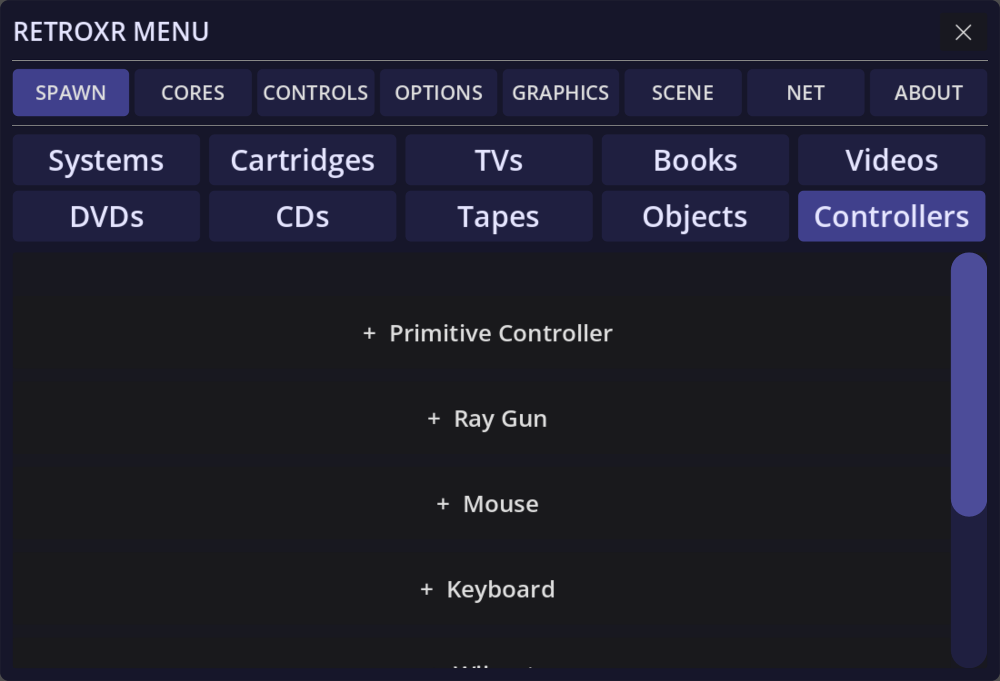

Everything in the room got there because you spawned it. The spawn menu is where that
happens.

- **In VR** — press the **Menu button** on your **left** controller.
- **On desktop** — press `Tab`.

The panel appears in front of you, facing the way you were looking. Point at it and pull
the **trigger** to click.

## The tabs

Across the top are the sections of the menu:

| Tab | What it is for |
| --- | --- |
| `SPAWN` | Bringing objects into the room |
| `CORES` | Downloading emulators, picking defaults, checking BIOS |
| `CONTROLS` | Input bindings |
| `OPTIONS` | App settings, including the web file manager |
| `GRAPHICS` | Quality, resolution, refresh rate, performance HUD |
| `SCENE` | Rooms, and saving or restoring a layout |
| `NET` | Netplay |
| `ABOUT` | Credits, licenses and the donate link |

## What you can spawn

Under `SPAWN` there are ten tabs — Systems, Games, TVs, Books, Videos, DVDs, CDs,
Tapes, Objects and Controllers:

**Games** — your ROMs. Clicking one spawns a cartridge carrying that game, straight
into the hand that clicked. If a game has been scraped, its row also has a 📖 button that
spawns the scanned manual as a book.

**Books** — your PDFs and CBZs, as physical books.

**Videos** — your video files, as VHS tapes.

**DVDs** — your disc images, as DVDs.

**Objects** — the hardware itself: the VCR, the DVD player, the CD player and cassette
deck, speakers, the TV remote, every kind of A/V cable, the RF switch, the Wii sensor bar,
and the room's own props like the bin.

**Controllers** — pads, peripherals and the receivers they plug into.

## Picking things up and putting them down

- **Grip** grabs whatever your hand is near.
- Let go and it falls. Objects have weight and will knock each other over.
- Set something on a shelf, a desk or the floor and it stays there.

You can also grab at a distance by pointing at an object and using the trigger, which is
easier for something across the room.

:::tip
An object spawned from the menu lands directly in the hand that clicked, so you never have
to chase it across the floor.
:::

## Keeping a layout

A room you have wired up is worth keeping. The `SCENE` tab saves the whole arrangement —
every object, where it sits, and what is plugged into what — and restores it later.

See [rooms and saving](/guide/room/rooms-and-saving/).
