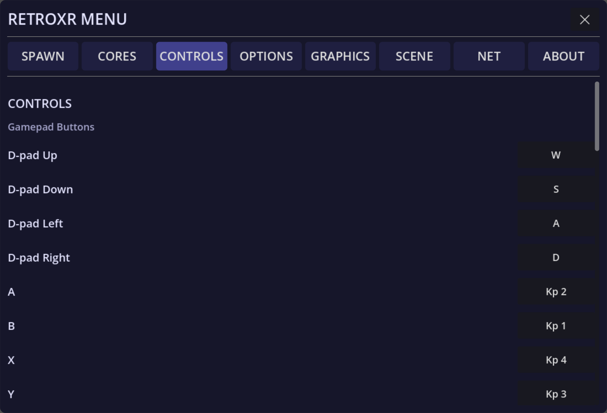

With no VR headset detected, RetroXR falls back to a desktop mode driven by mouse and
keyboard. Everything in the room still works — you are just reaching into it with a cursor
instead of your hands.

## Moving and looking

| Input | Does |
| --- | --- |
| `W` `A` `S` `D` | Move |
| Mouse | Look |
| `Ctrl` *(hold)* | Crouch |
| `Caps Lock` *(hold)* | Walk — slower, for fine positioning |

## Handling things

| Input | Does |
| --- | --- |
| Left-click | Grab or pick up whatever is under the cursor |
| `Ctrl` + Left-click | Drop the held object |
| Scroll wheel | Push or pull the held object along the view ray |
| Middle-mouse drag | Rotate the held object in place |
| `Tab` | Toggle the spawn menu |

Two objects — the **ray gun** and the **TV remote** — snap to a fixed position on screen
while held, the way an FPS weapon does. Those need `Ctrl` + Left-click to drop; a plain
click will not do it, and the scroll wheel does nothing while they are snapped. Everything
else drops on a plain click too.

If you are holding the ray gun, left-click fires it rather than grabbing.

## Playing a game

When a running system has input focus, the keyboard acts as a retro joypad. The current
mapping is always visible under the **`CONTROLS`** tab:

| Control | Keys |
| --- | --- |
| D-pad | `W` `A` `S` `D` |
| Face buttons | Numpad `1`=B, `2`=A, `3`=Y, `4`=X |
| Shoulders | `L` = `Q` / `R` / Numpad `3` · `R` = `E` / `Y` / Numpad `6` |
| Triggers | `L2` = `Z` · `R2` = `X` |
| Stick clicks | `L3` = `C` · `R3` = `V` |
| Select / Start | `Shift` / `Enter` |
| Left stick | `T` `G` `F` `H` — up, down, left, right |
| Right stick | `I` `K` `J` `L` — up, down, left, right |

A real gamepad plugged into the PC works too, and is a great deal more pleasant — see
[controllers and peripherals](/guide/playing/controllers/).

## Reading a book

With a book held: `E` turns to the next page, `Q` to the previous one.
