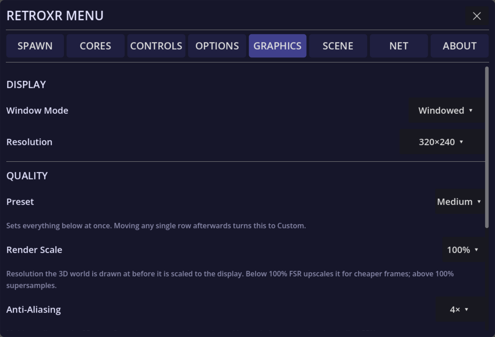

## Graphics

Under **`GRAPHICS`**:

- **Quality preset** — the single dial to reach for first.
- **Render scale** and **eye buffer** — resolution, traded against frame rate.
- **Refresh rate** — a higher rate is smoother but leaves less time per frame.
- **CPU and GPU levels** — how hard the headset is allowed to work.
- **Anti-aliasing**, **shadows** and **ambient occlusion**.

### The performance HUD

There is a HUD showing frame timing, memory, scene load and emulation cost. You can mount
it in view, or on your wrist so it is there when you look down and gone when you do not.

If the room feels heavy, turn this on before changing settings blindly — it tells you
whether you are short on CPU or GPU, which point at completely different fixes.

## Comfort

Under **`OPTIONS`**:

- **Slide or teleport** movement.
- **Snap or smooth** turning, with an adjustable snap angle.
- A **field-of-view vignette** while moving.
- **Height offset** and **world scale**.

If VR movement bothers you, teleport plus snap turning plus the vignette is the
combination to start from.

## Emulator picture

Emulated screens are deliberately kept sharp rather than smoothed — a blurry CRT
defeats the point. The picture is sampled so that pixel edges stay crisp without the
shimmering you would get from no filtering at all.

:::caution[Needs an in-headset pass]
The settings here are enumerated from the options and graphics screens in the source. The
groupings are right, but exact control labels and ranges have not been checked against a
running build.
:::
