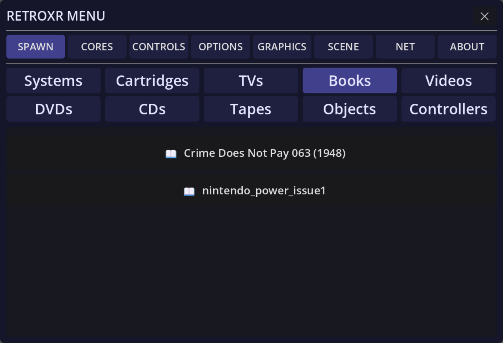

Books in RetroXR are not a reader UI. They are objects you pick up, hold, and turn the
pages of.

## Getting books in

Put files into the `books/` folder:

- **Windows** — `%USERPROFILE%\retroxr\books`
- **Linux / macOS** — `~/retroxr/books`
- **Quest** — `/sdcard/Android/data/com.xenu.retroxr/files/books`

Supported: **`.pdf`** and **`.cbz`** (a ZIP of `.jpg`, `.png` or `.webp` page images). CBR
and loose image files are not listed.

## Reading one

Open **`SPAWN`** → **Books** and click a title. It drops straight into the hand that
clicked.

Pages are rendered from the file on demand and cached to disk, so the first open of a big
scan takes a moment and every open after that is instant.

## Turning pages

<video src="/video/book_flip.mp4" autoplay loop muted playsinline
	aria-label="A hand grabs the outer edge of a comic page and drags it across; the page folds over to reveal the next spread."
	style="width:100%;border-radius:0.75rem;border:1px solid var(--sl-color-hairline-shade);margin-block:1.25rem"></video>

**In VR** — hover a controller over the outer edge of a page, hold the **trigger**, and
drag the page across. Release past halfway and the turn completes; release short of it and
the page springs back.

Holding the book one-handed, you can also poke the far edge with your other hand and
squeeze **grip** to flip.

**On desktop** — with the book held, `E` is the next page and `Q` the previous one.

## Book settings

Point at the book and press the **menu button** for a small panel with two controls:

- **Size** — 0.5× to 2.5×, for everything from a pocket manual to a broadsheet.
- **Half pages** — splits a scanned two-page spread down the middle, so a magazine scanned
  as spreads reads one page at a time.

## Game manuals

If a game has been scraped, its row in the **Cartridges** tab has a 📖 button that spawns
the manual as a book. Leave it open on the desk next to the TV while you play, which is
what manuals were for.

See [box art and manuals](/guide/connecting/box-art/).

## Putting one down

Set a book on any shelf or desk and it stays there, open at the page you left it. Pick it
back up with **grip**, or with the pointer ray from across the room.
