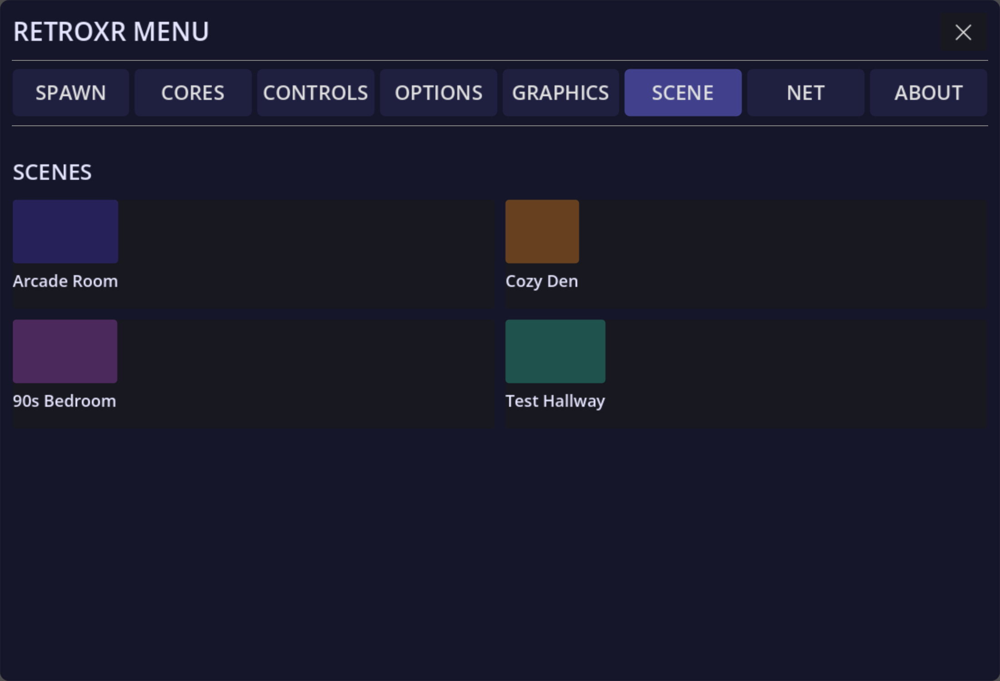

## The rooms

RetroXR gives you somewhere to put all this. Switch rooms from the **`SCENE`** tab.

- **Arcade room** — the default space.
- **Cozy den** — a lounge, with a corner TV stand and somewhere to sit.
- **Bedroom** — a bedroom with a desk, a bed, bookcases and a wardrobe.
- **Test hallway** — a long hall of pre-cabled stations, one per generation. Useful for
  trying a lot of systems quickly without wiring each one.
- **Passthrough** — your actual room, in AR, with the hardware placed into it.

Rooms have working props: light switches, a pull-cord lamp, a ceiling fan, blinds, string
lights, and a bin for things you are finished with.

:::note[Every room is a placeholder]
All of these are stand-ins. They are somewhere to put your hardware, not finished
environments — the room you actually want to play in has not been built yet.

**If you model, this is where help would go furthest.** Rooms are a bigger, more visible
win than any single console shell, and there is no existing art to match. The one rule is
that everything must be free of trademarked text and images, and licensed so the project
can ship it.

Say hello on [Discord](https://discord.gg/mdjdBDTdW) or open an issue on
[GitHub](https://github.com/XenuIsWatching/RetroXR/issues).
:::

## Saving a layout

Wiring a console to a TV, plugging in a controller and setting it all out takes a few
minutes, and you should only have to do it once.

The **`SCENE`** tab saves the whole arrangement — every object, where it is, and what is
plugged into what — into a slot, and restores it later.

Save slots are **per room**, so a layout saved in the den does not appear in the bedroom's
list.

:::note
When a saved layout is restored, everything is placed before physics is allowed to act on
it, so the room assembles itself rather than raining onto the floor. Cables re-lay
themselves to follow their plugs.
:::

## Autosave

Layouts can be kept automatically, so quitting and coming back puts you where you left
off rather than in an empty room.

:::caution[Needs an in-headset pass]
The room list and the save/restore model are read from the code. The exact controls on the
`SCENE` tab — slot naming, how many slots, and the autosave toggle's location — have not
been checked against a running build.
:::
