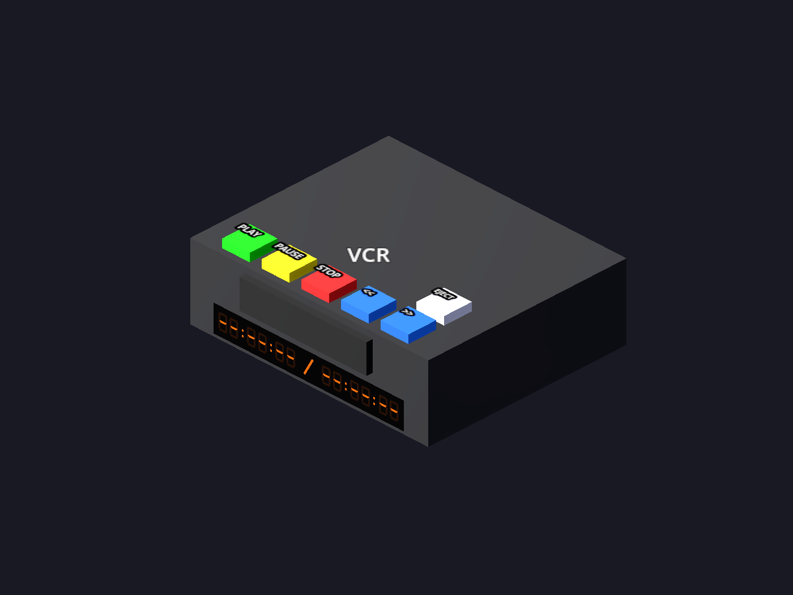

The VCR takes your own video files and plays them onto a television, the same way a
console does. It runs on libVLC, so it handles a wide range of formats including
x265/HEVC.

:::caution[Not on macOS]
The packaged libVLC backend ships on Windows, Linux and Quest. A macOS build from source
has no VCR and no DVD player.
:::

## Getting a tape

Put video files into the `videos/` folder:

- **Windows** — `%USERPROFILE%\retroxr\videos`
- **Linux / macOS** — `~/retroxr/videos`
- **Quest** — `/sdcard/Android/data/com.xenu.retroxr/files/videos`

Recognized: `.mp4`, `.mkv`, `.avi`, `.webm`, `.mov`.

## Watching something

1. Open **`SPAWN`** → **Videos** and click a file. A **VHS tape** spawns carrying it — the
   same way a cartridge carries a ROM.
2. From **Objects**, spawn a **VCR** and a **TV**.
3. Run the VCR's A/V lead into the TV. See [plugging things
   in](/guide/playing/plugging-in/).
4. Push the tape into the slot.
5. Press **PLAY**.

## The buttons

| Button | Does |
| --- | --- |
| `PLAY` `PAUSE` | Transport |
| `STOP` | Stops, and ejects to a blank deck |
| `<<` `>>` | Rewind and fast-forward |

The deck has a glowing counter display, because of course it does.

You can also drive it from across the room with the [TV remote](/guide/room/tv-remote/).

## Sound and picture

The video renders onto whichever TV the VCR is plugged into, and the **television's** own
volume and power buttons control it — exactly as they do for a console. Picture but no
sound is usually the set's volume, not the deck's.
